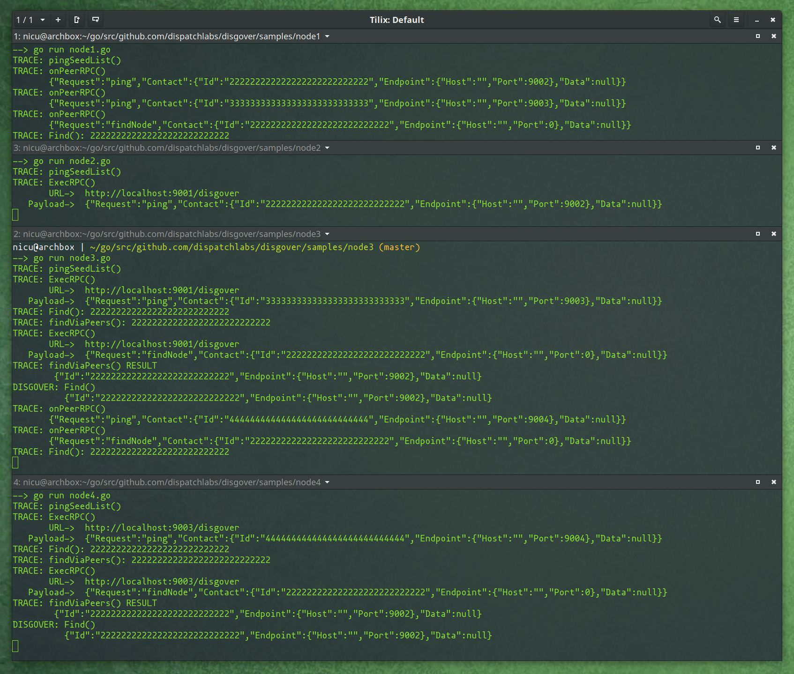

# Build
- `protoc --go_out=plugins=grpc:. *.proto`


# WARNING
__Use a fast DNS__
```shell
nano /etc/resolv.conf
nameserver 8.8.8.8
```
With a slow DNS it takes 5 min to resolve dev stuff and build docker images, per image


# Run the nodes in Kubernetes
- `eval $(minikube docker-env)`
- Node 1
    - `cd samples/node1`
    - `docker build -t disgover-sample-node1:v1 .`
    - `docker tag JUST_CREATED_IMAGE_ID localhost:5000/disgover-sample-node1:v1`
    - `docker push localhost:5000/disgover-sample-node1:v1`
    - `kubectl run disgover-sample-node1 --image=localhost:5000/disgover-sample-node1:v1 --port=9001 --image-pull-policy=Never`
    - `kubectl describe pod disgover-sample-node1 | grep -e IP -e Port`

- Node 2
    - `cd samples/node2`
    - `docker build -t disgover-sample-node2:v1 .`
    - `docker tag JUST_CREATED_IMAGE_ID localhost:5000/disgover-sample-node2:v1`
    - `docker push localhost:5000/disgover-sample-node2:v1`
    - `kubectl run disgover-sample-node2 --image=localhost:5000/disgover-sample-node2:v1 --port=9002 --image-pull-policy=Never`
    - `kubectl describe pod disgover-sample-node2 | grep -e IP -e Port`

- Node 2
    - `cd samples/node3`
    - `docker build -t disgover-sample-node3:v1 .`
    - `docker tag JUST_CREATED_IMAGE_ID localhost:5000/disgover-sample-node3:v1`
    - `docker push localhost:5000/disgover-sample-node3:v1`
    - `kubectl run disgover-sample-node3 --image=localhost:5000/disgover-sample-node3:v1 --port=9003 --image-pull-policy=Never`
    - `kubectl describe pod disgover-sample-node3 | grep -e IP -e Port`


# Dispatch KDHT based node discovery engine
Distributed, node discovery mechanism that enables locating any 
entity (server, worker, drone, actor) based on node id.

The intent is to not be a data storage/distribution mechanism.
Meaning we implement only `PING` and `FIND-NODE` rpc.

One `disgover` instance in the node:
- stores info about numerous nodes
- functions as a gateway to outside local network

An example and to illustrate perhaps less familiar intents, if we 
want to find an actor "receptionist" in the global actor system, 
we could look for a contact that looks like this:
```javascript
var contact = {
    id: "tmqjRAfBILbEC6aaHoz3AurtluM=", // Base64 encoded receptionist address
    data: {
        webkey: "c9bf857b35ed4750ca35c0a4f41e56644df59547",
        host: "10.13.211.201",
        port: 9999,
        publicKey: "mQINBFJhVUwBEADRwsK6hvXoZU/niqZU2k9NXVNA9kAiVBfhUZ...WYco9YzK2K1Q="
    },
    transport: {
        host: "10.13.211.201",
        port: 6742
    }
};
```

# Core Concept
The Conceptual part is around
```go
type Contact struct {
	Id       string
	Endpoint Endpoint
	Data     interface{}
}
```

- `Id` - node ID
- `Endpoint` - where the node can be contacted
- `Data` - any additional paypload needed for extended functionalities and queries


# Samples


